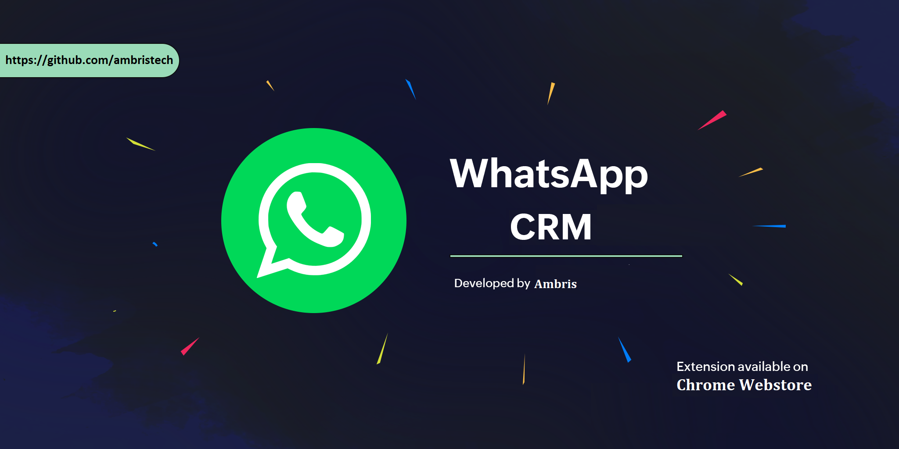

# WhatsBulk CRM – Chrome Extension

**WhatsBulk CRM** is a free, lightweight Chrome Extension that acts as a tiny CRM for sending personalized WhatsApp messages to your customers. Use it to send bulk or individual messages, birthday and anniversary wishes, and sales or discount offers — all directly from your browser!

This Chrome extension allows you to send WhatsApp messages to multiple phone numbers with customizable intervals through WhatsApp Web.
---



## ✨ Features

- 📤 Send WhatsApp Messages to single or multiple contacts
- 🎂 Auto-send Birthday & Anniversary Wishes
- 🛍️ Send Sales & Discount Offers to customers
- 📇 Built-in Tiny CRM for contact management
- 🌐 Works Offline (local system) or Online (MySQL database)
- 🆓 Completely Free – No ads, no limits!

---

## 🔧 Installation

1. Clone or download this repository:
   ```bash
   git clone https://github.com/your-username/whatsbulk-crm-extension.git

1. Download or clone this repository
2. Open Chrome and go to `chrome://extensions/`
3. Enable "Developer mode" in the top right corner
4. Click "Load unpacked" and select the extension directory

## Usage

1. Click on the extension icon in your Chrome toolbar
2. Enter phone numbers (one per line) with country code (e.g., 911234567890)
3. Enter your message
4. Set the interval between messages (in seconds)
5. Click "Start Sending"
6. Make sure you're logged into WhatsApp Web in your browser


## Important Notes

- Phone numbers must include the country code
- You must be logged into WhatsApp Web in your browser
- The extension will open a new tab for each message
- You can stop the sending process at any time by clicking the "Stop Sending" button
- Make sure to use this responsibly and in accordance with WhatsApp's terms of service

## Features

- Send messages to multiple phone numbers
- Customizable interval between messages
- Progress tracking
- Error handling
- Ability to stop sending at any time

💻 Requirements
Google Chrome

WhatsApp Web

Optional: MySQL database for online contact syncing

🧩 Usage
Add contacts manually or sync with your MySQL database.

Select one or multiple contacts.

Choose the message type (personal, promotion, special wishes).

Send directly via WhatsApp Web.

📦 Folder Structure
graphql
Copy
Edit
whatsbulk-crm-extension/
│
├── auth.php
├── api.php
├── manifest.json
├── background.js
├── login.html
├── login.js
├── popup.html
├── popup.js
├── register.html
├── register.js
├── styles.css
├── db_config.php      # Optional for MySQL integration
├── assets/            # Icons and logos
└── README.md
🔐 License
This project is licensed under the MIT License.

🙌 Support
For issues or suggestions, feel free to open an Issue or submit a PR.

🚀 Stay Connected. Stay Professional.
Reach out!📧 Email: ambristech@gmail.com.🌐 GitHub: ambristech

Built with ❤️ for efficient communication!

Let me know if you want help setting up the actual repo, README badges, or uploading project files.
